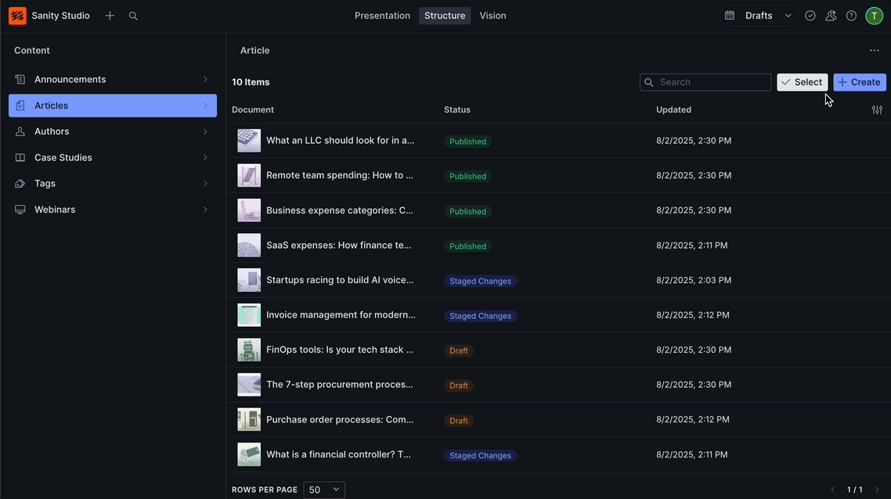

<div align="center">
  <h1>Sanity Bulk Actions Table Plugin</h1>
  <h3>A powerful table view with bulk actions for managing Sanity documents</h3>
  <p><em>Developed and maintained by <a href="https://contentwrap.io" target="_blank">ContentWrap</a></em></p>
  <p><em>Forked from <a href="https://github.com/ricokahler/sanity-super-pane" target="_blank">Sanity Super Pane</a></em></p>

  
  
  
  

  <br>
  <br>
  
</div>

---

## Features

- **📊 Table View**: Display your documents in a sortable, searchable table format with real-time updates
- **⚡ Bulk Actions**: Select multiple documents and perform batch operations (publish, unpublish, delete, discard changes)
- **🎛️ Dynamic Columns**: Interactive column selector to show/hide document fields with instant preview
- **🔍 Advanced Search**: Real-time search across text, slug, and number fields with smart filtering
- **📄 Smart Pagination**: Customizable page sizes (50 or 100 rows) with efficient loading
- **📝 Draft Management**: Seamlessly work with both published and draft documents with visual indicators
- **🔔 Error Handling**: Toast notifications for operation feedback and comprehensive error management
- **↕️ Flexible Sorting**: Click column headers to sort ascending/descending with visual indicators

---

## Installation

```sh
npm install sanity-plugin-bulk-actions-table
# or
yarn add sanity-plugin-bulk-actions-table
# or
pnpm add sanity-plugin-bulk-actions-table
```

---

## Usage

### Important: Structure Tool Integration

This plugin integrates with Sanity's **Structure Tool**, not as a regular plugin. It's configured in the `structure` function of your Sanity config, **not** in the `plugins` array.

### Basic Setup

Add the bulk actions table to your `sanity.config.ts` file using the structure configuration:

```typescript
import { defineConfig } from 'sanity';
import { structureTool } from 'sanity/structure';
import { createBulkActionsTable } from 'sanity-plugin-bulk-actions-table';

export default defineConfig({
  // ... your other configuration
  
  plugins: [
    structureTool({
      structure: (S, context) => {
        return S.list()
          .title('Content')
          .items([
            // Add a bulk actions table for your document type
            createBulkActionsTable({
              type: 'post', // Your document type
              S,
              context,
              title: 'Posts Table', // Optional: custom title
              icon: YourIcon, // Optional: custom icon
            }),
            // ... your other structure items
          ]);
      },
    }),
    // ... your other plugins
  ],
});
```

### Alternative: Separate Structure File

For larger projects, you can organize your structure in a separate file:

```typescript
// sanity.config.ts
import { defineConfig } from 'sanity';
import { structureTool } from 'sanity/structure';
import { structure } from './structure';

export default defineConfig({
  plugins: [
    structureTool({ structure }),
    // ... other plugins
  ],
});
```

```typescript
// structure.ts
import type { StructureResolver } from 'sanity/structure';
import { createBulkActionsTable } from 'sanity-plugin-bulk-actions-table';

export const structure: StructureResolver = (S, context) =>
  S.list()
    .title('Content')
    .items([
      createBulkActionsTable({
        type: 'post',
        S,
        context,
        title: 'Blog Posts',
      }),
      // ... other items
    ]);
```

### Configuration Options

The `createBulkActionsTable` function accepts the following options:

```typescript
interface CreateBulkActionsTableConfig {
  type: string; // Required: The document type to display
  S: StructureBuilder; // Required: Sanity structure builder
  context: ConfigContext; // Required: Sanity context with client and schema
  title?: string; // Optional: Custom title for the table view (defaults to document type)
  icon?: ComponentType | null | undefined; // Optional: Custom icon component for the navigation
  apiVersion?: string; // Optional: API version for GROQ queries (defaults to context version)
}
```

#### Configuration Reference

| Parameter | Type | Required | Default | Description | Example |
|-----------|------|----------|---------|-------------|---------|
| `type` | `string` | ✅ Yes | - | Document schema type name to manage in the table | `'post'`, `'page'`, `'product'` |
| `S` | `StructureBuilder` | ✅ Yes | - | Structure builder instance from structure resolver | Automatically provided by Sanity |
| `context` | `ConfigContext` | ✅ Yes | - | Configuration context with client and schema | Automatically provided by Sanity |
| `title` | `string` | ❌ No | Document type name | Custom title for Studio navigation | `'Blog Posts'`, `'Product Catalog'` |
| `icon` | `ComponentType \| null \| undefined` | ❌ No | Default table icon | React component for navigation icon | `DocumentIcon`, `FolderIcon` |
| `apiVersion` | `string` | ❌ No | Client's API version | GROQ API version for queries | `'2024-03-12'`, `'2023-05-03'` |

#### Type Definitions

For TypeScript users, you can import the configuration interface:

```typescript
import { CreateBulkActionsTableConfig } from 'sanity-plugin-bulk-actions-table';
```

### Example with Multiple Document Types

```typescript
export default defineConfig({
  structure: (S, context) => {
    return S.list()
      .title('Content Management')
      .items([
        createBulkActionsTable({
          type: 'post',
          S,
          context,
          title: 'Blog Posts',
        }),
        createBulkActionsTable({
          type: 'page',
          S,
          context,
          title: 'Pages',
        }),
        createBulkActionsTable({
          type: 'product',
          S,
          context,
          title: 'Products',
        }),
        S.divider(),
        // ... other structure items
      ]);
  },
});
```

---

## Features in Detail

### 🎛️ Dynamic Column Selection

The column selector provides complete control over your table view:

- **Interactive Interface**: Click the column filter button to open a dropdown with all available fields
- **Field Type Support**: Automatically detects and displays text, number, date, boolean, and reference fields
- **Instant Preview**: Columns are added/removed immediately as you toggle them
- **Persistent Settings**: Your column preferences are saved per document type
- **Smart Defaults**: Initially shows the most relevant fields based on your schema

### 🔍 Advanced Search & Filtering

Powerful search capabilities across your document fields:

- **Multi-Field Search**: Searches across all text, slug, and number fields simultaneously
- **Real-Time Results**: Results update instantly as you type
- **Smart Matching**: Uses partial matching with wildcard support for flexible searches
- **Field-Specific Search**: Automatically handles different field types (strings, slugs, numbers)
- **Input Validation**: Built-in sanitization prevents injection attacks and ensures query safety

### ↕️ Flexible Sorting

Comprehensive sorting functionality:

- **Column Header Sorting**: Click any column header to sort by that field
- **Visual Indicators**: Clear ascending (↑) and descending (↓) arrows show current sort direction
- **Toggle Sorting**: Click the same header again to reverse the sort order
- **Multi-Type Support**: Handles text, number, date, and boolean field sorting appropriately
- **Persistent State**: Sort preferences are remembered per document type

### 📄 Smart Pagination

Efficient handling of large document collections:

- **Customizable Page Sizes**: Choose from 50 or 100, or custom row counts
- **Navigation Controls**: First, previous, next, and last page buttons
- **Page Information**: Shows current page, total pages, and total document count
- **Performance Optimized**: Only loads visible documents for faster response times
- **Smooth Navigation**: Maintains selections and filters when changing pages

### ⚡ Bulk Actions & Selection

Comprehensive bulk operations for efficient document management:

#### Selection Interface

- **Select Mode Toggle**: Click "Select" to enter bulk selection mode
- **Individual Selection**: Check/uncheck documents individually
- **Select All**: Quickly select all documents on current page or across all pages
- **Visual Feedback**: Selected documents are clearly highlighted
- **Selection Counter**: Shows count of selected documents

#### Available Actions

- **📤 Publish**: Publish selected draft documents with validation
- **📥 Unpublish**: Unpublish selected published documents
- **🗑️ Delete**: Permanently delete selected documents (with confirmation dialog)
- **↩️ Discard Changes**: Revert draft changes to published version
- **Batch Processing**: All actions support multiple documents simultaneously

#### Safety Features

- **Confirmation Dialogs**: Destructive actions require explicit confirmation
- **Progress Indicators**: Shows operation progress for large batches
- **Error Handling**: Individual failures don't stop the entire batch operation

### 🔔 Error Handling & Notifications

Comprehensive feedback system for all operations:

- **Toast Notifications**: Success and error messages for all operations
- **Operation Status**: Real-time feedback during bulk operations
- **Network Error Handling**: Graceful handling of connection issues
- **Permission Errors**: Clear messages for insufficient permissions
- **Validation Feedback**: Helpful messages for invalid operations
- **Recovery Suggestions**: Actionable advice when operations fail

### 📝 Draft Management

Seamless integration with Sanity's draft system:

- **Visual Draft Indicators**: Clear distinction between published and draft documents
- **Draft-Only Actions**: Publish and discard actions only appear for applicable documents
- **Mixed State Handling**: Bulk operations intelligently handle mixed published/draft selections
- **Real-Time Updates**: Document states update immediately after operations

---

## Performance & Best Practices

### Optimization Features

- **Lazy Loading**: Documents are loaded on-demand as you navigate pages
- **Smart Caching**: Query results are cached to reduce redundant API calls
- **Efficient Pagination**: Only fetches the documents needed for the current page
- **Debounced Search**: Search queries are debounced to prevent excessive API calls
- **Selective Field Loading**: Only loads the fields you've selected as columns

### Best Practices

- **Column Selection**: Choose only the columns you need to improve loading times
- **Page Size**: Use smaller page sizes (10-25) for better performance with large datasets
- **Search Strategy**: Use specific search terms to reduce result sets
- **Bulk Operations**: Process documents in smaller batches for better reliability

### Performance Tips

- **Schema Design**: Ensure searchable fields are indexed in your Sanity dataset
- **Network**: The plugin respects your Sanity client configuration for API endpoints and CDN
- **Memory**: The plugin automatically manages memory by releasing unused data when navigating

---

## Requirements

- Sanity Studio v3/v4
- React 18+
- Node.js 16+
- TypeScript (recommended)

---

## Acknowledgments

This plugin is built upon the excellent foundation created by **[Rico Kahler](https://github.com/ricokahler)** with the original [Sanity Super Pane](https://github.com/ricokahler/sanity-super-pane) plugin. 

The original plugin provided innovative bulk action capabilities for Sanity Studio v2, but was not compatible with Sanity Studio v3/v4. This project forks and modernizes that work while maintaining the core functionality that made the original so valuable.

Special thanks to Rico for creating such a useful tool for the Sanity community.

---

## License

MIT © [ContentWrap](https://contentwrap.io)

---

## Contributing

Contributions are welcome! Please feel free to submit a Pull Request.

## Issues

If you encounter any issues, please report them on [GitHub Issues](https://github.com/contentwrap/sanity-plugin-bulk-actions-table/issues).
